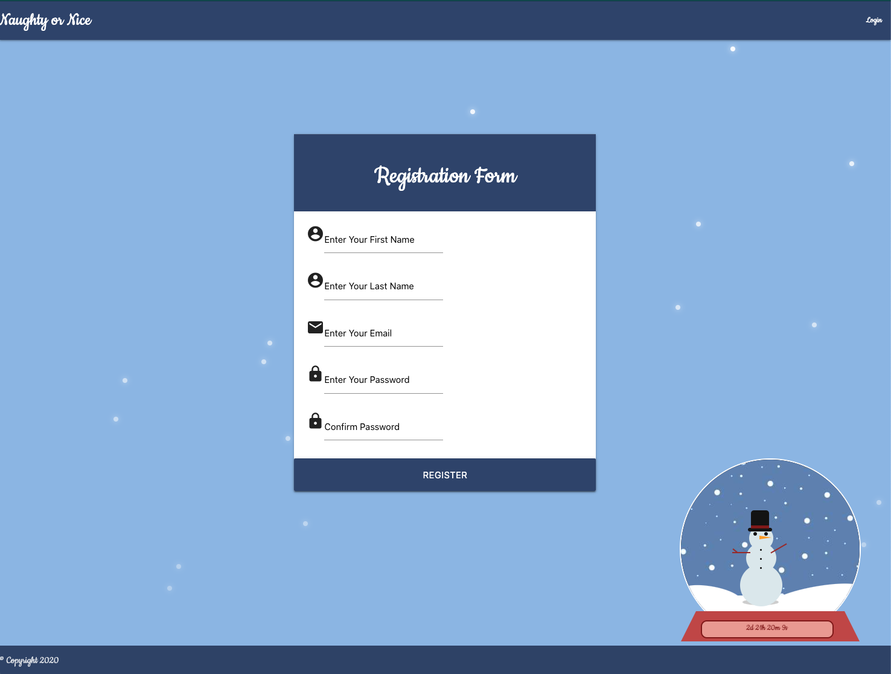
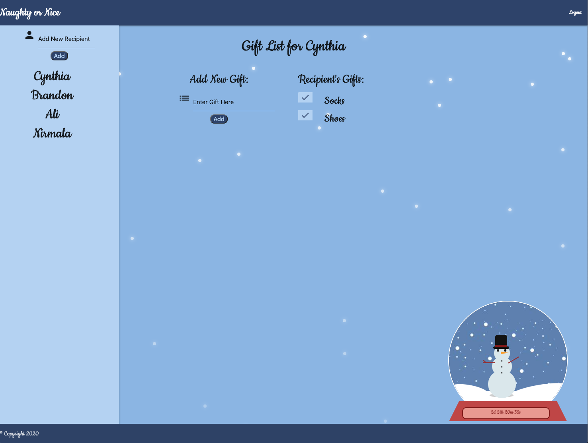

# Naughty or Nice Gift Tracking Application


Explore the [Project Page](https://github.com/NirmalaAbothu/Naughty_or_Nice)

View it live on [Heroku](https://evening-springs-93825.herokuapp.com/)

## Table of Contents
- [About The Project](#about-the-project)
    - [Built With](#built-with)
- [Installation](#installation)
- [Usage](#usage)
  - [Demo](#demo)
- [Future Development](#future-development)
- [Contributing](#contributing)
- [License](#license)
- [Contact](#contact)


## About The Project
As the holiday season rolls around, it can be a daunting task to keep track of all the people and gifts on your gift list. The Naughty and Nice Gift Tracking application works simplifies this task by allowing you to store all of you friends and loved ones, and your gift ideas, in one place. 

<hr>

**Login Page**


**Signup Page**



**Members Page**



<hr>

### Built With

This project was built using:

* JavaScript
* [Materialize](https://materialize.com/docs/)
* [jQuery](https://jquery.com/)
* [Node.js](https://nodejs.org/api/fs.html)
* [MySQL2](https://www.npmjs.com/package/mysql2)
* [MySQL Workbench](https://www.mysql.com/products/workbench/)
* [Sequelize](https://sequelize.org/)
* [Express.js](https://expressjs.com/)
* [express-session](https://www.npmjs.com/package/express-session)
* [Passport](https://www.npmjs.com/package/passport)
* [Passport-Local](https://www.npmjs.com/package/passport-local)
* [bcryps.js](https://www.npmjs.com/package/bcryptjs)
* [dotenv](https://www.npmjs.com/package/dotenv)
* [Handlebars](https://handlebarsjs.com/)
* [file-system](https://www.npmjs.com/package/file-system)
* [Path](https://nodejs.org/api/path.html)
* [Nodemon](https://www.npmjs.com/package/nodemon)

## Installation

This project is deployed live on Heroku, so it is not necessary to install locally to give it a try! However, you may get a local copy up and running by following these simple steps:

1. Clone the repo
```sh
git clone git@github.com:NirmalaAbothu/Naughty_or_Nice.git 
```

2. Install NPM packages (i.e., express, mysql2, etc.)
```sh
npm install
```

3. Locate the "config.js" file in the config directory. Change the password to your password. 
```sh
"username": "root",
"database": "xmasList_db",
"port": 3306,
"host": "127.0.0.1",
"dialect": "mysql"
```

## Usage
To use this application, the user must login, or if not already a member, create an account. Once logged in, the user will be directed to their own personal member's page, where recipient/gift lists will appear if previously created. 

This application can be used throughout the year to keep track of gift recipients and associated gift lists. Recipients and gift lists can be removed as needed. 

### Demo

Watch the short video below to see how the program works.


## Future Development
Below is a list of additional features and content the development team would like to add to this project moving forward:

* Additional functionality of the Member's page, that allows a user to move and categorize (i.e., family vs. friends) their recipients. 
* Connection of gift items to external shopping resources, like Amazon or Walmart. 

## Contributing

Contributions are what make the open source community such an amazing place to  learn, inspire, and create. Any contributions you make are **greatly appreciated**.

1. Fork the Project
2. Create your Feature Branch (`git checkout -b feature/AmazingFeature`)
3. Commit your Changes (`git commit -m 'Add some AmazingFeature'`)
4. Push to the Branch (`git push origin feature/AmazingFeature`)
5. Open a Pull Request

## License
This project is licensed under the permissive open source MIT license.

## Contact

Project Link: [https://github.com/NirmalaAbothu/Naughty_or_Nice](https://github.com/NirmalaAbothu/Naughty_or_Nice)

Live Link:[https://evening-springs-93825.herokuapp.com/](https://evening-springs-93825.herokuapp.com/)